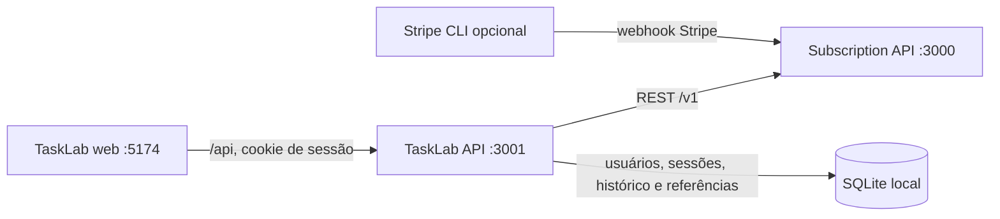

# Integração da TaskLab com a Subscription

Este documento descreve a integração que a POC em `example/` implementa hoje.
O backend da TaskLab é o único cliente da Subscription API; o navegador fala
somente com a API local da TaskLab. Os exemplos e limitações abaixo refletem o
código atual, não um contrato de produção.

## Componentes e limites de responsabilidade



- `example/web` cuida da interface, sessão no navegador, formulários e
  apresentação de saldo, checkouts e execuções.
- `example/backend` autentica a conta da POC, associa-a a um workspace da
  Subscription e chama a Subscription via `SubscriptionClient` (`reqwest`).
- A Subscription é dona do catálogo comercial, plano do cliente, billing,
  carteiras, extratos, elegibilidade, medição de uso e confirmação de pagamento.
- O SQLite da TaskLab guarda usuários e sessões da demonstração, identificadores
  do catálogo criado para a POC e referências/histórico de checkout e execução.
  Ele não é a fonte de saldo nem de pagamentos.
- No sandbox, o Stripe CLI encaminha webhooks diretamente para a Subscription.
  TaskLab não recebe webhooks de pagamento.

## Identidade e provisionamento do workspace

Ao registrar uma conta, TaskLab gera UUIDs separados para o usuário, o workspace
de cobrança da Subscription, os eventos `workspace.created` e
`workspace.activated` e o `correlation_id`. O workspace identifica a conta que
paga; não representa cada tarefa ou workspace de infraestrutura.

Depois do registro e também no login, `provision_workspace` envia os dois
eventos para `POST /v1/internal/accounts/workspace-events`, na ordem `sequence`
1 e 2. O envelope tem `schema_version: 1`, `aggregate_id` e `workspace_id` com o
mesmo UUID, os IDs estáveis de evento e a relação de causação do evento de
ativação. A TaskLab assina os bytes serializados do corpo com HMAC-SHA256 de
`<timestamp Unix>.<corpo>` e envia `x-runvibe-timestamp` e
`x-runvibe-signature: v1=<HMAC em base64>`. O mesmo segredo deve estar em
`ACCOUNTS_WEBHOOK_SECRET` nos dois serviços. Reenvios no login reutilizam IDs e
conteúdo, permitindo à inbox da Subscription deduplicar a entrega.

O UUID de workspace é criado localmente pela TaskLab e enviado no evento; a API
de aplicação não provisiona uma identidade de usuário ou associação de membros
na Subscription. Autenticação, senha (hash Argon2), sessões e autorização da
conta pertencem à TaskLab.

## Catálogo da demonstração

`npm run setup` executa `cargo run --manifest-path backend/Cargo.toml -- setup`.
O comando usa o mesmo SQLite da TaskLab para guardar IDs em `catalog_settings`
e cria/ativa os recursos remotos via API:

| Recurso | Configuração TaskLab |
| --- | --- |
| `Product` | `TaskLab`, modelo `CREDIT_METERED` |
| `Item` | `Tarefa`, unidade `tarefa`, escala `1` |
| `PriceVersion` | modelo `unit`, bloco de 1 tarefa custa 1 crédito |
| `Subscription` pré-paga | `TaskLab pré-pago`, modelo `CREDIT_STRICT` |
| Plano FREE | `Conta pré-paga`, acesso aberto ao produto, sem concessão inicial |
| `Subscription` mensal | `TaskLab mensal`, modelo `CREDIT_STRICT` |
| Plano PAID | R$ 29,90 BRL por mês, cartão aceito, 50 créditos por ciclo |
| Planos de recarga | 10, 25 ou 50 créditos por R$ 10,00, R$ 25,00 ou R$ 50,00 |

Os recursos são vinculados pelo produto incluído nos planos. `setup_catalog`
guarda os IDs e reutiliza os que já existem; portanto, reutilize o mesmo banco
SQLite para evitar criar outro catálogo. As chamadas relevantes são
`POST /v1/products`, `POST /v1/products/{product_id}/items`,
`POST /v1/items/{item_id}/price-versions`, publicação da versão de preço,
`PATCH` para ativar produto/item, `POST /v1/subscriptions`, criação de planos e
`POST /v1/subscriptions/{subscription_id}/on-demand-plans`.

## Escolha de modalidade e plano do cliente

O onboarding oferece duas opções:

1. **Pré-pago:** `POST /api/plan` chama `choose_plan`, que cria um customer plan
   para o plano FREE via `POST /v1/workspaces/{workspace_id}/customer-plans`.
   A chave de idempotência usada na Subscription é
   `tasklab-free:{workspace_id}`. A TaskLab persiste `plan_model=PREPAID` e o
   `customer_plan_id`.
2. **Assinatura mensal:** o onboarding inicia diretamente um checkout inicial.
   O backend ativa `recurring_credit_enabled` em
   `/v1/workspaces/{workspace_id}/billing-config` com controle otimista por
   `expected_version`, cria o customer plan do plano PAID com chave
   `tasklab-plan:{transaction_id}`, e guarda `plan_model=SUBSCRIPTION` e o ID
   localmente antes de solicitar o checkout.

A conta pré-paga não pode trocar para assinatura nesta POC. A opção de assinatura
não cria recorrência automática no navegador: a aquisição inicial passa pelo
fluxo de Billing da Subscription descrito abaixo.

## Checkout e pagamentos

O navegador envia `POST /api/checkouts` com `checkout_kind` e, para recarga,
`topup_credits`. Envia também `Idempotency-Key`, mantida no `sessionStorage` por
conta/modalidade/pacote para que uma repetição represente a mesma intenção. O
backend deriva uma chave de serviço `tasklab-checkout:{user_id}:{transaction}` e
envia à Subscription:

```json
{
  "checkout_kind": "ON_DEMAND",
  "customer_plan_id": "<customer_plan_id>",
  "on_demand_plan_id": "<plano_de_recarga>",
  "transaction_id": "<transação estável>"
}
```

Para o checkout `INITIAL`, `on_demand_plan_id` é omitido. A rota remota é
`POST /v1/workspaces/{workspace_id}/checkouts`; a resposta fornece
`checkout_id`, status, valor, moeda, créditos concedidos e, se criado, a
referência de cobrança. TaskLab persiste uma referência e consulta o estado em
`GET /v1/workspaces/{workspace_id}/checkouts/{checkout_id}`. A resposta de
criação `PENDING` é devolvida como HTTP 202 pela API TaskLab; o frontend consulta
até sair de `PENDING` e então atualiza o painel.

O valor submetido ao checkout não vem do formulário: Subscription resolve os
termos a partir do plano e do pacote cadastrados. O formulário de cartão fica na
TaskLab, que encaminha PAN/CVC pela sua API autenticada à Subscription. A
Subscription envia os dados ao provedor, valida o SetupIntent e guarda a
referência tokenizada e o nome de exibição quando o usuário opta por salvar o
cartão. O nome é informado pelo usuário ou gerado com os últimos quatro dígitos;
PAN e CVC não são persistidos.

### Fluxo de tokenização

1. O frontend coleta nome, número, validade e CVC, além de um nome opcional para
   identificar o cartão salvo, e pede autorização para reutilizá-lo. Ele envia
   os dados somente à rota autenticada da API TaskLab, com uma chave
   `Idempotency-Key`.
2. A API TaskLab garante um `CustomerPlan` e encaminha os dados à
   `POST /v1/workspaces/{workspace_id}/payment-methods/from-card` da Subscription.
   O backend TaskLab não grava nem registra o corpo do cartão.
3. Subscription resolve a integração e o Customer esperados, confirma um
   SetupIntent `off_session` na Stripe e valida o resultado. Se o usuário marcou
   “salvar”, Subscription cria o vínculo tokenizado; caso contrário, desanexa o
   método após a validação.
4. Apenas o ID do vínculo salvo volta ao TaskLab; a recarga seguinte usa esse ID
   no checkout normal da Subscription. Número e CVC nunca são armazenados.

A Subscription envia os dados ao endpoint de cartão da Stripe. Para essa
integração de teste, a conta Stripe precisa ter acesso às APIs de dados brutos de
cartão habilitado; esse acesso é restrito pela Stripe e não deve ser usado em
produção sem a aprovação e o escopo PCI adequados. TaskLab não possui credencial,
chave pública, ID de conexão ou chamada de API Stripe.

Para testar, digite um cartão de teste na TaskLab. A Subscription retorna a
recusa do SetupIntent à interface sem persistir PAN/CVC. `BILLING_SANDBOX_PAYMENT_SCENARIO`
controla somente o método interno de demonstração quando o checkout não informa
um vínculo tokenizado.

Para sandbox, configure `BILLING_SANDBOX_ENABLED=true`, `STRIPE_SECRET_KEY`
`sk_test_...`, `STRIPE_WEBHOOK_SECRET` `whsec_...` e
`BILLING_SANDBOX_PAYMENT_SCENARIO=APPROVED` ou `DECLINED` no ambiente da
Subscription. `make run` inicia o Stripe CLI quando o sandbox está ligado; o
script valida o segredo do listener e entrega webhooks a
`/v1/billing/webhooks/stripe` da Subscription. Stripe CLI e credenciais são
opcionais quando não se está testando checkout.

## Carteira, painel e extratos

`GET /api/dashboard` combina dados locais com leituras da Subscription:

- `/v1/workspaces/{workspace_id}/customer-wallet/statement?limit=50`: extrato
  da carteira principal, incluindo créditos concedidos e débitos;
- `/v1/workspaces/{workspace_id}/products/{product_id}/eligibility`: acesso ao
  produto e saldo elegível;
- `/v1/workspaces/{workspace_id}/items/{item_id}/item-wallet`: medidor e custo
  do próximo bloco;
- `/v1/workspaces/{workspace_id}/items/{item_id}/item-wallet/statement?limit=50`:
  histórico do medidor;
- `/v1/workspaces/{workspace_id}/payment-method-bindings`: cartões tokenizados
  salvos para a conta;
- SQLite local: últimas 20 referências de checkout e últimas 20 execuções.

Elegibilidade e medidor podem ser omitidos da resposta agregada se a consulta
falhar; o extrato de carteira é necessário para responder ao dashboard. A UI
exibe créditos usando os dados retornados pela Subscription, não calcula saldo a
partir do SQLite.

Para remover um cartão salvo, TaskLab chama a rota autenticada
`DELETE /v1/workspaces/{workspace_id}/payment-method-bindings/{binding_id}` da
Subscription. A Subscription valida o workspace, desanexa o método na Stripe e
marca o vínculo como `DETACHED`, preservando o histórico de cobranças. A remoção
é idempotente para vínculos já desanexados.

## Execução de tarefa e débito de uso

O navegador gera e mantém um `transaction_id` em `sessionStorage` até receber
sucesso. `POST /api/executions` valida o nome da tarefa e a transação, procura
primeiro uma execução concluída localmente e então consulta elegibilidade e
medidor. Essas leituras são informativas: a TaskLab ainda precisa chamar o
comando transacional de uso, que revalida saldo, entitlement, carteira e preço
na Subscription.

A chamada é `POST /v1/workspaces/{workspace_id}/usage-events`, com uma chave
`tasklab-usage:{user_id}:{transaction_id}` e corpo equivalente a:

```json
{
  "transaction_id": "<transação estável>",
  "product_id": "<product_id>",
  "item_id": "<item_id>",
  "item_units": "1",
  "expected_price_version_id": "<versão indicada pelo medidor>",
  "occurred_at": null,
  "metadata": {"tasklab_execution_id": "<execution_id>"}
}
```

Se a Subscription aceitar o evento, TaskLab marca a execução como `COMPLETED`
e retorna o resultado da demonstração. Se houver conflito ou rejeição de
validação, persiste `REJECTED` com a mensagem e retorna erro. A chave e a
transação estáveis permitem repetir uma chamada após resposta perdida. O limite
de 1 crédito é definido pelo preço unitário configurado; uma quantidade de uma
tarefa gera o débito conforme a versão de preço ativa. Uma verificação local
prévia pode rejeitar cedo por falta de saldo, mas não substitui a validação
transacional na Subscription.

## API local da TaskLab

Rotas em `example/backend/src/routes.rs`:

| Método e caminho | Uso |
| --- | --- |
| `POST /api/auth/register` | Cria conta, provisiona workspace, abre sessão |
| `POST /api/auth/login` | Autentica, reenvia eventos de workspace, abre sessão |
| `POST /api/auth/logout`, `GET /api/me` | Encerra ou consulta sessão |
| `POST /api/plan` | Seleciona a opção pré-paga FREE |
| `GET /api/dashboard` | Agrega carteira, catálogo, medidor e histórico |
| `POST /api/payment-method-setup` | Encaminha dados do formulário à Subscription para validar o cartão e, com consentimento, criar o vínculo |
| `POST /api/payment-method-bindings` | Valida uma referência opaca de setup hospedado, mantida para integrações que usem esse fluxo |
| `GET /api/payment-method-bindings` | Lista vínculos tokenizados ativos |
| `DELETE /api/payment-method-bindings/{binding_id}` | Solicita à Subscription a desanexação e remoção do cartão salvo |
| `POST /api/checkouts` | Cria checkout inicial ou recarga, com `Idempotency-Key` |
| `GET /api/checkouts/{id}` | Atualiza o estado do checkout |
| `POST /api/executions` | Registra e cobra uma execução idempotente |
| `GET /api/history` | Lista as últimas 50 execuções locais |

As rotas de conta exigem o cookie `tasklab_session`, `HttpOnly`, com expiração
de oito horas. O frontend chama `/api` no mesmo origin de Vite; o proxy de
desenvolvimento encaminha à API local.

## Configuração e execução local

`example/.env.example` define:

| Variável | Responsabilidade |
| --- | --- |
| `APP_HOST`, `APP_PORT` | Listener do backend TaskLab; padrão `127.0.0.1:3001` |
| `DATABASE_URL` | SQLite local da TaskLab |
| `SUBSCRIPTION_API_URL` | Endereço HTTP da Subscription; local padrão `:3000` |
| `ACCOUNTS_WEBHOOK_SECRET` | Segredo compartilhado para assinar eventos de workspace |

Copie para `example/.env`, use o mesmo segredo de webhook nos dois serviços,
rode `npm install`, `npm run setup` dentro de `example/` e `make run` na raiz.
O Makefile inicia Subscription (`3000`), admin-ui (`5173`), TaskLab API
(`3001`), web (`5174`) e o encaminhador Stripe CLI quando necessário.

## Limitações atuais e operação segura

- A POC oferece uma modalidade pré-paga ou assinatura inicial por conta; não
  oferece troca de plano, cancelamento pela interface, renovação automática ou
  recarga de conta assinante.
- A coleta direta de dados do cartão é somente para o sandbox. PAN/CVC passam
  transitoriamente pela API TaskLab, não são registrados nem persistidos, e são
  encaminhados à Subscription; produção requer integração tokenizada no cliente
  para que os servidores TaskLab não recebam esses dados.
- A TaskLab guarda estado em SQLite local; perder ou trocar o arquivo perde
  sessão, associação de plano, catálogo configurado e histórico local. Os
  lançamentos e pagamentos confirmados continuam na Subscription.
- O backend local não tem uma credencial de serviço própria para chamar a
  Subscription. A integração é uma POC de desenvolvimento, não uma fronteira de
  autenticação pronta para exposição pública.
- A aplicação não agenda a execução de infraestrutura real: após o débito,
  produz um resultado demonstrativo. Também não implementa reserva ou
  compensação automática se uma execução real falhar depois da cobrança.

Para executar o fluxo local detalhado, consulte o [README da TaskLab](../../example/README.md).
