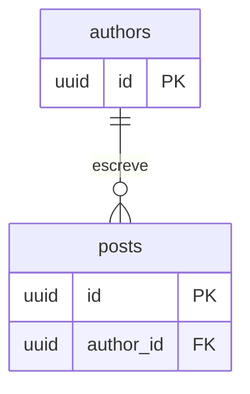
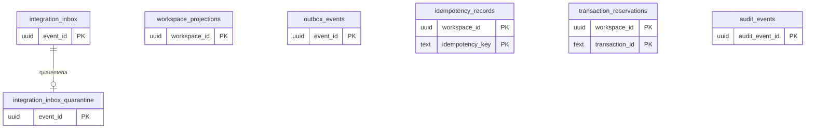
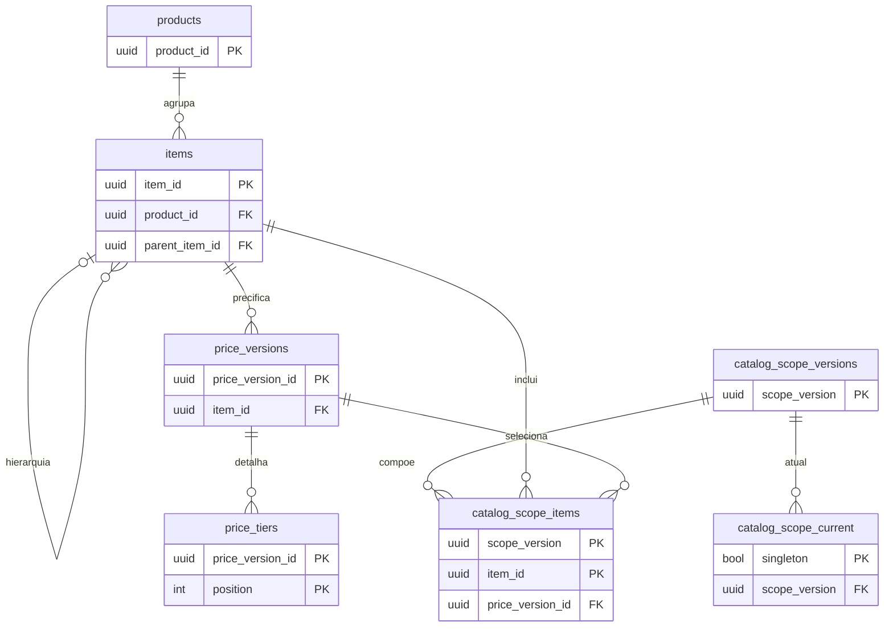
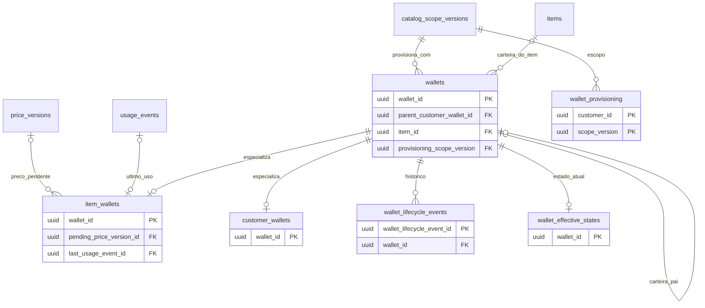
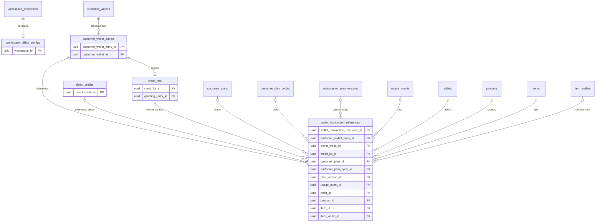
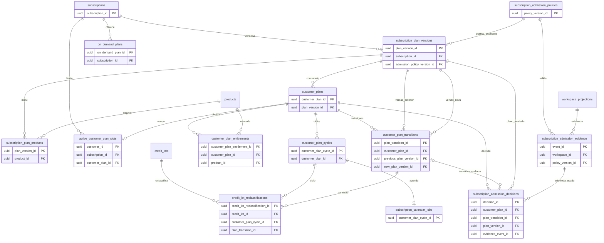
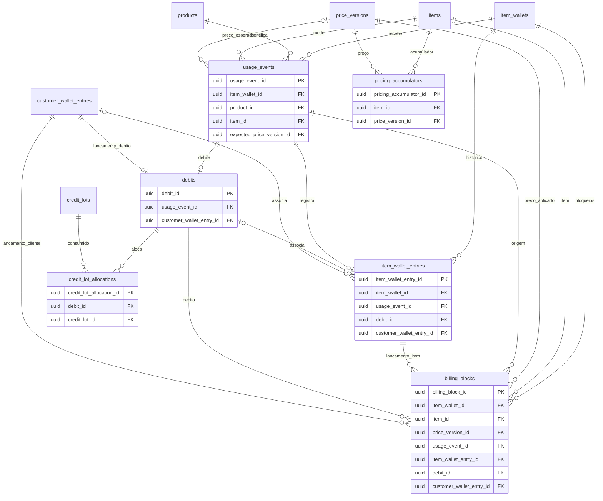
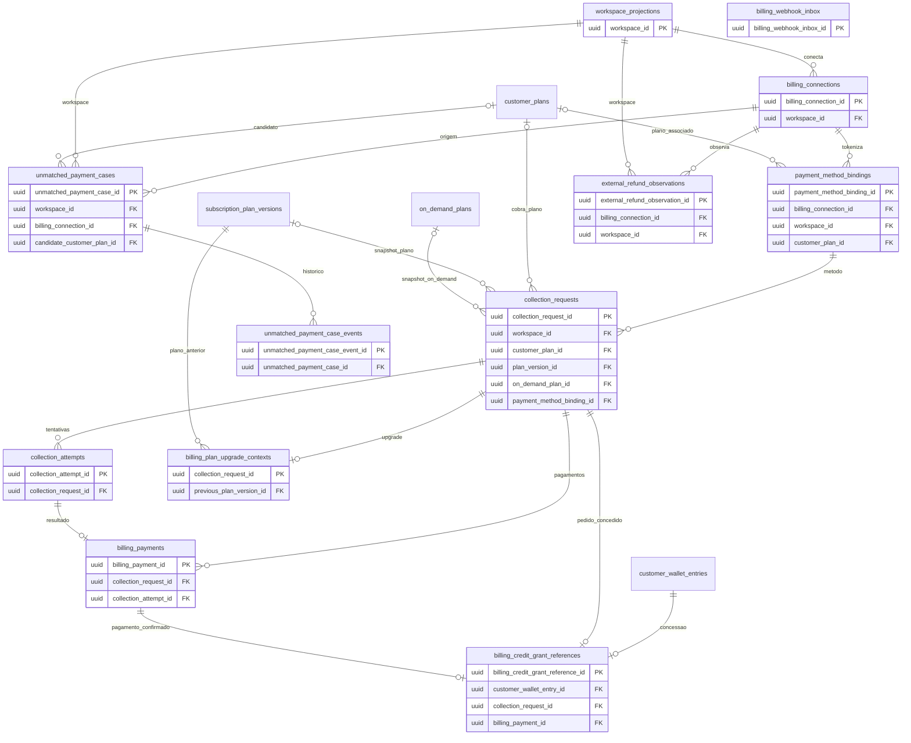

# Modelo de dados da API

Este documento descreve o schema PostgreSQL criado pelas migrations em `migrations/`. Os diagramas incluem todas as tabelas e todas as relações declaradas por chave estrangeira. Para facilitar a leitura, cada entidade mostra sua chave primária (`PK`) e suas chaves estrangeiras (`FK`); os demais campos, restrições e índices estão definidos nas migrations.

As migrations `202609...` formam o modelo de Subscription API. `authors` e `posts`, criadas pela migration inicial `202601020000_init.sql`, são tabelas de exemplo do bootstrap e não participam dos fluxos da API de assinaturas.

## Visão por domínio

### Bootstrap de exemplo

### Workspace, integração e auditoria

`integration_inbox_quarantine.event_id` referencia o evento recebido. `outbox_events`, `idempotency_records`, `transaction_reservations` e `audit_events` não têm FK para o workspace: o escopo é identificado pelo UUID recebido de Accounts. `workspace_projections.last_event_id` também não é FK para a inbox; é a identidade do último evento aplicado.

### Catálogo e preços

### Provisionamento de carteiras

`wallets.parent_customer_wallet_id` é autorreferência e deve apontar para a carteira do mesmo cliente do tipo `CUSTOMER`; a regra é validada por trigger. `wallets.customer_id` e `wallet_provisioning.customer_id` são identificadores externos de cliente/workspace, sem FK local. `item_wallets.pending_price_version_id` referencia `price_versions`; `last_usage_event_id` referencia `usage_events` (mostrado também no diagrama de consumo).

### Créditos e razão da carteira

`wallet_transaction_references` é uma referência tipada/polimórfica: `reference_kind` exige exatamente o campo correspondente (por exemplo, `DIRECT_CREDIT`, `CUSTOMER_PLAN_CYCLE`, `USAGE_EVENT` ou `ITEM_WALLET`). A tabela tem FKs para os alvos listados, mas cada linha preenche apenas o alvo selecionado. `direct_credits.customer_id` e `credit_lots.customer_id` são IDs externos; a origem do lote é vinculada ao lançamento em `granting_entry_id`.

### Assinaturas, ciclos e admissão

`customer_plans.customer_id` e `active_customer_plan_slots.customer_id` identificam o workspace/cliente fornecido por Accounts; não há FK para `workspace_projections`. O slot ativo materializa no máximo um plano vigente por cliente e assinatura e é mantido por trigger para planos `ACTIVE`/`ACTIVE_PAID` com renovação `CURRENT`. A agenda também é materializada por trigger a partir de ciclos ativos de planos gratuitos. `subscription_plan_versions` é uma versão publicada e imutável; o vínculo com política de admissão é opcional e permitido quando a admissão exige aprovação.

### Medição de uso

`item_wallets.last_usage_event_id` também referencia `usage_events`. `usage_events.customer_id`, `pricing_accumulators.customer_id` e os campos de cliente em outras tabelas são escopos externos sem FK local. A aceitação do evento, a atualização dos medidores, o débito na carteira do cliente e as alocações de lotes são gravados transacionalmente.

### Billing, pagamentos e conciliação

As FKs compostas de Billing preservam o escopo: uma conexão pertence ao mesmo workspace da forma de pagamento; plano, binding, cobrança e caso não conciliado precisam pertencer ao mesmo cliente/workspace. `billing_webhook_inbox` é uma inbox idempotente do provedor, sem FK para pagamento; a associação é resolvida durante o processamento por IDs e metadados do evento. `billing_credit_grant_references` registra, no máximo uma vez, a relação entre lançamento, pedido de cobrança e pagamento que concedeu créditos.

## Convenções e limites do modelo

- `workspace_id` e `customer_id` representam a identidade do workspace/cliente mantida por Accounts. Quando não há FK para `workspace_projections`, essa ausência é intencional: a API consome a identidade e os eventos de Accounts sem replicar a tabela proprietária de clientes.
- Relações desenhadas como linhas nos diagramas correspondem a FKs, salvo relações descritas explicitamente como conceituais. Campos como `aggregate_id`, `resource_id`, `actor_reference`, IDs dentro de `payload` e IDs de cliente sem FK são referências polimórficas ou externas, não relações garantidas pelo banco.
- Tabelas de razão, decisões de admissão, eventos de ciclo de vida e observações de provedor preservam histórico append-only por triggers. Catálogos publicados também têm proteção de imutabilidade.
- Para conferir a definição física exata e a evolução de cada campo, consulte os arquivos `migrations/*.up.sql` em ordem cronológica.
